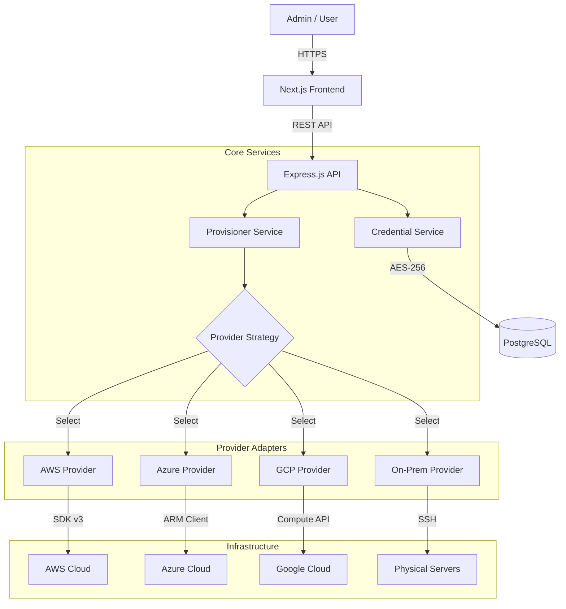

# Clusters Control Plane

**A unified, multi-tenant Kubernetes management platform built for the enterprise.**

---

## 🎯 Project Goals

1.  **Unified Cloud Abstraction**: Eliminate the complexity of managing disparate cloud APIs. Provide a single, normalized interface for provisioning clusters on AWS, Azure, GCP, and On-Premises hardware.
2.  **Strict Multi-Tenancy**: Enforce hard boundaries between organizations. Ensure that data, credentials, and resources are strictly isolated per tenant to meet enterprise compliance standards.
3.  **Secure by Design**: Prioritize security at every layer—from AES-256 encrypted credentials at rest to Role-Based Access Control (RBAC) in the API and active credential verification before use.
4.  **Extensible Architecture**: Build a backend that can easily accommodate new cloud providers without rewriting core business logic, utilizing the Strategy Pattern.

---

## 🏗 Architecture

The platform follows a **Clean Architecture** approach, separating the core business logic from external infrastructure concerns.

### High-Level Design

### Key Components

- **ClusterProvider Interface**: The heart of the extensibility. All cloud providers implement this contract (`deploy`, `destroy`, `getKubeconfig`).
- **Organization Context**: A middleware layer that injects `organization_id` into every request, ensuring queries are always scoped to the user's tenant.
- **Active Verification System**: A dedicated validator module that tests credentials against real cloud APIs before they are accepted.

---

## 🚀 Key Features

### 🏢 Enterprise Multi-Tenancy

- **Strict Isolation**: Resources (Clusters, Credentials) are strictly scoped to Organizations.
- **Role-Based Access Control (RBAC)**: Global **Admin Mode** vs. Scoped **User Mode**.
- **Context Switching**: Seamlessly toggle between organizations via the UI.

### ⚡ Unified Operations

- **One Interface, Any Cloud**: Normalized operations for AWS, Azure, GCP, and On-Prem.
- **Real-time Validation**: Active API verification for all credentials (AWS STS, Azure RG, etc.).

### 🔒 Security

- **Encryption at Rest**: AES-256 for all API keys and secrets.
- **Audit Ready**: Full strict resource tagging.

---

## 🛠 Tech Stack

| Domain             | Technology                                                                                                          |
| :----------------- | :------------------------------------------------------------------------------------------------------------------ |
| **Frontend**       | [Next.js 14](https://nextjs.org/) (App Router), [Tailwind CSS](https://tailwindcss.com/)                            |
| **Backend**        | [Node.js](https://nodejs.org/), [Express.js](https://expressjs.com/), [TypeScript](https://www.typescriptlang.org/) |
| **Database**       | [PostgreSQL](https://www.postgresql.org/) (with `pg` driver)                                                        |
| **Infrastructure** | Docker, Docker Compose                                                                                              |

---

## 📄 License

MIT © 2024 Cluster Control Plane
